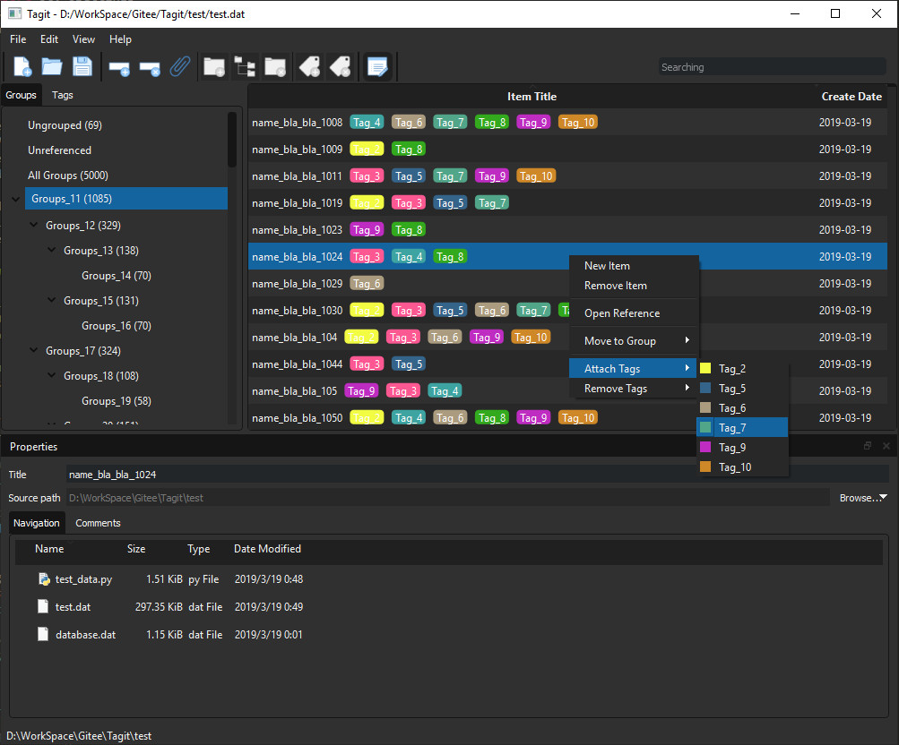

# TAGIT

我们通常使用文件夹结构来分类管理文档/个人知识，但单一的目录结构难以有效组织具有交叉关系的内容。例如，以电影类型例如科幻片、战争片、剧情片来命名分类文件夹是个不错的选择，但同时我们很可能希望将同一导演/演员的作品组织在一起，于是不得不按照这个标准重新建立分类文件夹，并且需要重复复制文档。针对此类问题，考虑以虚拟的目录结构和标签来管理硬盘上实际存储的文档（文本/多媒体），这便是`Tagit`。

区别于笔记类应用，`Tagit`并不进行实际文档的创建和编辑，而是侧重以逻辑分类和标签来管理已经存在的文档；它更倾向于文献管理类软件，但不涉及文献格式方面的功能，而是着重于分类组织的能力。

## 开发工具

Python3, PyQt5

## 主要功能

项目的初衷是解决对本地存储的学习资源的管理，顺便成为学习和实践PyQt5的一次机会。

- 分类管理（Group）
    - 支持无限级分类
    - 创建/修改/删除
    - 分类下条目数量统计

- 标签管理（Tag）
    - 自定义标签颜色
    - 创建/修改/删除
    - 标签下条目数量统计
    - 拖拽修改标签顺序

- 条目管理（Item）
    - 建立与源文档路径的映射
    - 添加/修改分类（一个条目属于唯一分类）
    - 添加/修改标签（一个条目可以添加多个标签）
    - 拖拽条目添加分类/标签
    - 按分类/标签筛选条目
    - 关键字筛选条目    
    - 数据存储（目前采用`pickle`直接存储数据）

- 用户界面
    - 自定义UI样式（目前支持`default`和`dark`风格）

## 预览

